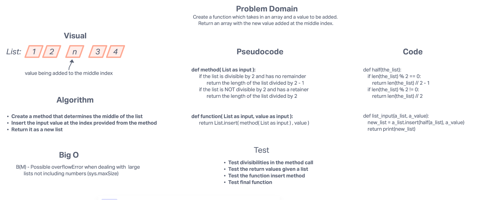

# Array insert shift  
The challenge is to whiteboard (using a visual) a solution for taking in an array and a value to be added to the middle
of that array.  

## Whiteboard Process

## Approach & Efficiency
The first thing I thought of when I saw this problem domain is that I can take the length of the list and divide it in
half. I'll then take that value and use it as my index. I figure it's the most efficient method I could propose based
on the data types given, and I won't have to build any sort of loops/recursions.
