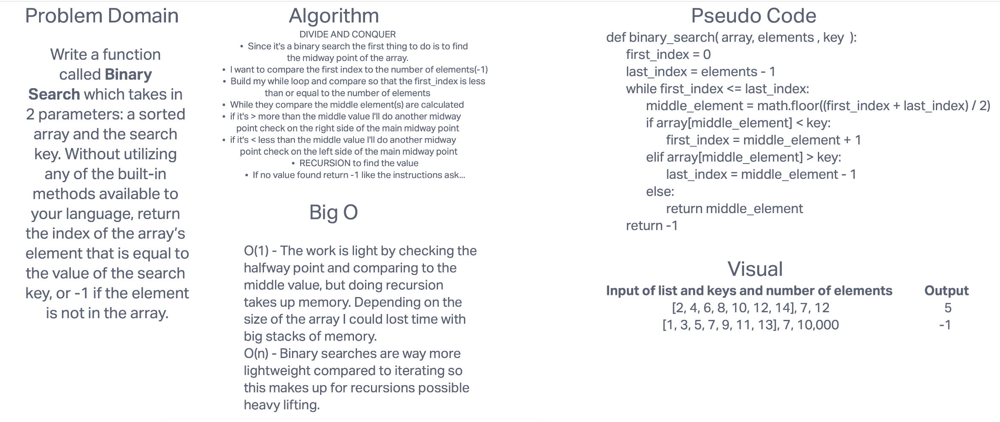

# Binary Search of Sorted Array
I am to build a function which takes in an array and a key value to search for in the array using binary
search.

## Whiteboard Process


## Approach & Efficiency
Binary search is a little more intricate that a normal iteration in my opinion, but the code is still
fairly small. My approach was to do a recursive while loop comparing the first index to the last index
in order to whittle the search down in case the middle point isn't already the number. In the case that
the middle number is lower than my target value it moves the first index one index above it and keeps the 
highest index in place. It then finds a new midway point. This happens in the opposite way should the midway
point is higher than the target value. Feel free to try my code in IDLE or Charm. It works! 

> Note: the one thing I added (which I can make into a supportive function) is another parameter for the 
> total number of elements in the array.

```python
import math
def binary_search( array, elements , key  ):
	first_index = 0
	last_index = elements - 1
	while first_index <= last_index:
		middle_element = math.floor((first_index + last_index) / 2)
		if array[middle_element] < key:
			first_index = middle_element + 1
		elif array[middle_element] > key:
			last_index = middle_element - 1
		else:
			return middle_element
	return -1
```