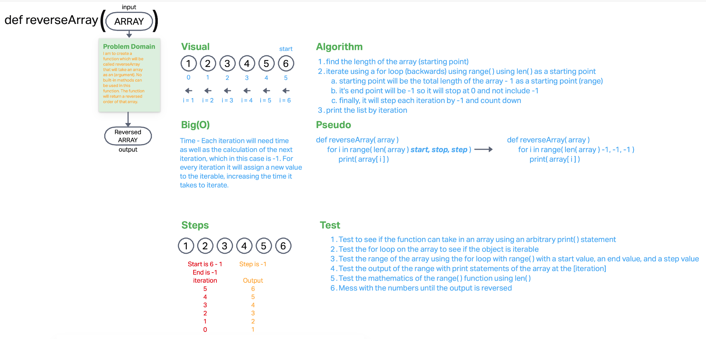

# Reverse an Array
The challenge is to whiteboard a solution for reversing an array using a function named reverseArray  

## Whiteboard Process

## Approach & Efficiency

I approached the solution in the same way I might do with Javascript. I want to iterate from the back of the array and
 iterate towards the front. This means I'll have to start with the total length of the array and loop through the array
 using the length value as the starting point. In terms of BIG O this takes a minimalist approach to solving the solution
 given any array. The steps increase as the input gets larger, which means the time it takes to process increases. I don't 
think (currently) that I can find a faster solution with Big O mindeset.